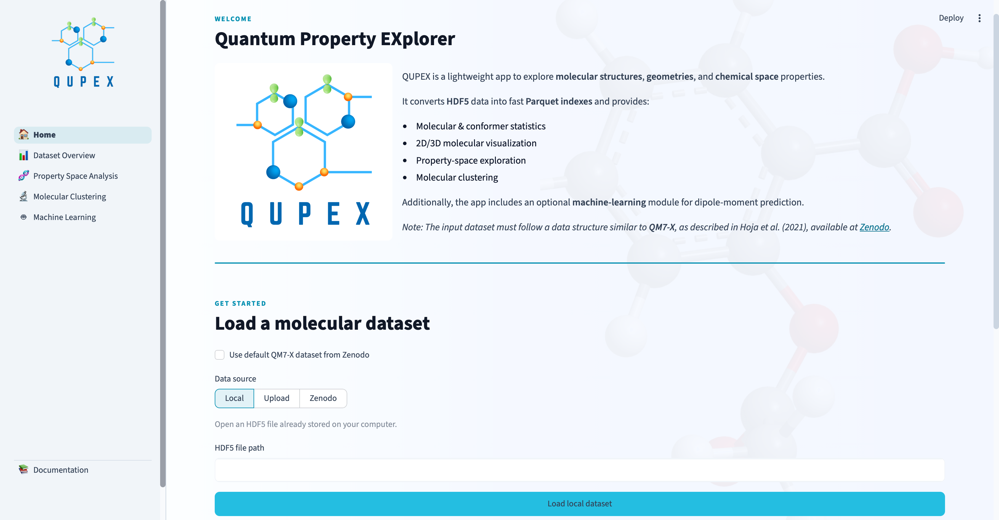

# QUPEX

[](https://www.python.org/)
[](LICENSE)
[](https://streamlit.io/)
[](https://zenodo.org/)

QUPEX — **QUantum Property EXplorer** — is an interactive [Streamlit](https://streamlit.io) application for the exploration, visualization, statistical analysis, and machine-learning-based prediction of dipole moments, built around the **QM7-X** quantum-chemistry dataset.

QUPEX converts QM7-X-format HDF5 files into lightweight, cached Parquet indexes and provides four analysis pages covering dataset composition and geometry statistics, 2D/3D molecular structure visualization and property correlations, PCA/t-SNE chemical-space analysis with Gaussian-Mixture clustering, and dipole-moment prediction using a pretrained XGBoost model with SHAP-based interpretability.

## Contents

- [Features](#features)
- [Screenshot](#screenshot)
- [Installation](#installation)
- [Running the app](#running-the-app)
- [Testing the machine-learning prediction functionality](#testing-the-machine-learning-prediction-functionality)
- [Data sources](#data-sources)
- [Caching](#caching)
- [Project structure](#project-structure)
- [Main components](#main-components)
- [Application pages](#application-pages)
- [Reproducibility notes](#reproducibility-notes)
- [QM7-X attribution](#qm7-x-attribution)
- [License](#license)
- [Citation](#citation)

## Features

* **Dataset Overview** — explore dataset statistics, composition, geometries, and QM7-X properties.
* **Property Space Analysis** — visualize property distributions, correlations, molecular structures, and atomic-level information.
* **Molecular Clustering** — explore molecular similarity using PCA, t-SNE, and Gaussian Mixture Models.
* **Machine Learning** — predict dipole moments using a pretrained XGBoost model with validation and SHAP interpretability.
* **Flexible Data Loading** — load the default QM7-X dataset or custom HDF5 datasets from local files, uploads, or Zenodo.
* **Documentation** — access in-app information about QUPEX, its data sources, and how to interpret the results.


## Screenshot

<p align="center">
  
  <br>
  <em>Figure 1. Landing page of the application, featuring the default‑dataset option and the three supported data‑loading modes: Local file, Upload, and Zenodo.</em>
</p>


## Installation

QUPEX requires Python 3.10+ (developed against Python 3.10). The steps below assume [Conda](https://docs.conda.io/) (Miniconda or Anaconda) is installed; a plain virtual environment works too — see the note at the end of this section.

1. **Clone the repository:**

   ```bash
   git clone https://github.com/Mirtha-Pillaca/QUPEX
   cd QUPEX
   ```

2. **Create a dedicated Conda environment.** We recommend using the project name as the environment name.

   ```bash
   conda create --name qupex python=3.10
   ```
    This creates an isolated environment with Python 3.10 for the application, keeping its dependencies separate from other Python projects. When prompted, enter `y` to confirm the installation.

  
4. **Activate the environment:**

   ```bash
   conda activate qupex
   ```

5. **Install the Python dependencies:**

   ```bash
   python3 -m pip install -r requirements.txt
   ```

6. **Streamlit is installed automatically.** `streamlit` is already included in `requirements.txt`, If it's ever missing (e.g. after a partial or manual install), install it explicitly:

   ```bash
   python3 -m pip install streamlit
   ```

*Not using Conda?* A plain virtual environment works the same way — replace steps 2–3 with:
```bash
python3 -m venv .venv
source .venv/bin/activate        # Windows: .venv\Scripts\activate
```
then continue from step 4.

### macOS requirement: `libomp`

6. **Install OpenMP on macOS.** The `scikit-learn`, `xgboost`, and `shap` packages used by the **Machine Learning** page depend on OpenMP. macOS does not include OpenMP by default, so it must be installed separately using [Homebrew](https://brew.sh/).

   If Homebrew is already installed, run:

   ```bash
   brew install libomp
   ```
   
   No further configuration is required.

   **Note for macOS users:** The application automatically handles a potential OpenMP compatibility issue that can occur when multiple versions of `libomp.dylib` are loaded by Conda, `scikit-learn`, and `xgboost`. No additional action is required from the user.

   
## Running the app

7. Start the application from the repository root, with the Conda environment activated:

   ```bash
   streamlit run app.py
   ```

8. Streamlit prints a local URL (typically `http://localhost:8501`) and normally opens it in your default browser automatically; if it doesn't, open that URL manually. The app starts on the **Home** page.

The **Home** page's "Get Started" section is where a dataset is loaded:

- **Use default QM7-X dataset from Zenodo** (unchecked by default) — check it to load the QM7-X dataset directly from a fixed Zenodo URL, with no need to enter anything. The file downloads once on first use and is cached locally afterwards; every later run (and every app restart) reuses the cached copy instead of re-downloading it.
- Leave it unchecked to pick a data source instead:
  - **Local** — select an HDF5 file already stored on your computer.
  - **Upload** — upload an HDF5 file through the browser.
  - **Zenodo** — provide a different Zenodo file URL. The app downloads and caches the file locally.

The first time a given file is loaded, the application builds its Parquet indexes. These are cached under `data/index_cache/`, using a hash of the source file's identity. Subsequent loads of the same file reuse the cache. 

> **Note:** Building the index for the full QM7-X file can take some time during the first load. This is expected and only occurs once for each source file.

The Machine Learning page downloads its pretrained model and validation datasets automatically from a separate Zenodo record the first time they are needed. These files are cached under `models/` and reused on subsequent runs. See [Data sources](#data-sources) for more information.

If a download fails, for example because there is no network connection, the affected page displays a clear error message and stops safely.

> **Important:** The **Machine Learning** page does not require a QM7-X dataset to be loaded first. It only requires its own pre-trained model file.

### Troubleshooting

9. **Common installation and startup issues:**

   - **`ModuleNotFoundError` for a package listed in `requirements.txt`** — Make sure the Conda environment is activated and that the dependencies have been installed. Re-run the installation step if necessary.

   - **`xgboost` fails to import on macOS** (for example, an error mentioning `libomp.dylib`) — Install `libomp` via Homebrew as described in the [macOS requirement](#macos-requirement-libomp), then restart the app.

   - **The app crashes when unpickling the model or running a prediction on macOS** — This may be related to an OpenMP (`libomp.dylib`) conflict. The application handles this issue automatically when started with `streamlit run app.py`. Do not import the Machine Learning page directly.

   - **A "PNG export requires Kaleido" message appears** instead of a downloadable image — Make sure `kaleido` is installed from `requirements.txt`. Re-run the dependency installation step if necessary.

   - **A page shows "No dataset is currently loaded"** — This is expected behavior, not an error. Return to the **Home** page and load a dataset using the default Zenodo dataset, Local, Upload, or a Zenodo URL. The **Machine Learning** page is the only exception and does not require a QM7-X dataset to be loaded first.

   - **Port already in use** — Start the application on another port:

     ```bash
     streamlit run app.py --server.port <another_port>
     ```

     Then open the URL displayed by Streamlit in your browser.

## Testing the machine-learning prediction functionality

A ready-to-use sample file, [`test_dftb_dipole_dataset.csv`](test_dftb_dipole_dataset.csv), is included in the repository root so the dipole-moment prediction workflow can be tried out without preparing your own descriptor data.

To use it:

1. Open the app and go directly to the **Machine Learning** page (no QM7-X dataset needs to be loaded first for this page).
2. Switch to the **🔮 New-data prediction** tab.
3. Under "Upload a dataset", upload `test_dftb_dipole_dataset.csv` from the repository root.
4. The app validates that the file contains the 40 required descriptor columns (listed under "Required input format" on that tab, e.g. `FermiEne`, `BandEne`, `TBeig_1`…`TBeig_8`, `TBchg_1`…`TBchg_23`) and shows a preview of the loaded rows.
5. Click **Run prediction** to generate dipole-moment predictions, view the summary metrics and distribution plot, and optionally download the results as a CSV.

This file is a convenience test dataset for exercising the prediction workflow only; it is not part of the QM7-X dataset and is not used anywhere else in the application.

## Data sources

The application uses datasets and pretrained Machine Learning artifacts hosted on Zenodo. These large binary files are **not included in this repository**.

- **QM7-X dataset** — The default dataset can be downloaded automatically from Zenodo through the **Home** page. It is cached locally after the first download.
- **Custom datasets** — HDF5 files can also be loaded using the **Local**, **Upload**, or **Zenodo** options.
- **Machine Learning model** — The pretrained model and validation datasets are downloaded automatically from Zenodo when required by the **Machine Learning** page.

## Caching

Downloaded files are cached locally and reused on subsequent runs, so they do not need to be downloaded again.

- Datasets: `data/`
- Machine Learning files: `models/`
- Dataset indexes: `data/index_cache/`

> **Note:** To force a new download, delete the corresponding cached file.

For detailed information about the available datasets and Zenodo records, see the [Documentation](#documentation).

## Project structure

```text
QUPEX/
├── app.py
├── home.py
├── pages/
│   ├── 1_Dataset_Overview.py
│   ├── 2_Property_Space_Analysis.py
│   ├── 3_Molecular_Clustering.py
│   ├── 4_Machine_Learning.py
│   └── 5_Documentation.py
├── modules/
│   ├── loader.py
│   ├── prepare_indexes.py
│   ├── ml_tools.py
│   ├── molecular_visualization.py
│   ├── plot_distributions.py
│   ├── datasets.py
│   ├── theme.py
│   └── plot_style.py
├── data/
├── models/
├── assets/
├── test_dftb_dipole_dataset.csv
├── requirements.txt
└── README.md
```

### Main components

| Component | Description |
|---|---|
| `app.py` | Main application entry point and navigation |
| `home.py` | Home page and dataset loading |
| `pages/` | Main application pages |
| `modules/` | Data processing, visualization, and Machine Learning utilities |
| `data/` | Local datasets and cached indexes |
| `models/` | Pretrained Machine Learning models and validation data |
| `assets/` | Images and other static resources |
| `test_dftb_dipole_dataset.csv` | Example dataset for testing new-data prediction |
| `requirements.txt` | Python dependencies |


### Application pages

1. **Dataset Overview** — Dataset composition and statistics
2. **Property Space Analysis** — Property distributions, correlations, pairwise analysis, and molecular visualization
3. **Molecular Clustering** — PCA, t-SNE, and GMM clustering
4. **Machine Learning** — Dipole-moment prediction, validation, SHAP analysis, and new-data prediction
5. **Documentation** — Application documentation, data sources, and references

## Reproducibility notes

The application uses fixed datasets and pretrained Machine Learning models archived on Zenodo. When the default QM7-X dataset is selected, all users work with the same source file, making the resulting analyses directly comparable across runs and machines.

Machine Learning validation metrics are recomputed from the archived model and validation data each time validation is run. Clustering and SHAP analyses are computed dynamically based on the dataset and parameters selected by the user.

## QM7-X attribution

This application is built around the **QM7-X** dataset and follows its HDF5 data organization and property conventions. QM7-X is not redistributed with this repository.

> J. Hoja, L. Medrano Sandonas, B. G. Ernst, A. Vazquez-Mayagoitia, R. A. DiStasio Jr., and A. Tkatchenko, "QM7-X, a comprehensive dataset of quantum-mechanical properties spanning the chemical space of small organic molecules," *Scientific Data*, vol. 8, no. 43, 2021. DOI: [10.1038/s41597-021-00812-2](https://doi.org/10.1038/s41597-021-00812-2)
>
> Dataset archive: [10.5281/zenodo.4288677](https://zenodo.org/records/4288677)

Please cite the original QM7-X publication when using this dataset in derived work, in addition to any citation requested for this application (see [Citation](#citation)).

## License

This project is licensed under the MIT License. See the [LICENSE](LICENSE) file for details.


## Citation

If you use this application in your research, please cite the project accordingly. Citation details will be provided here once available.
